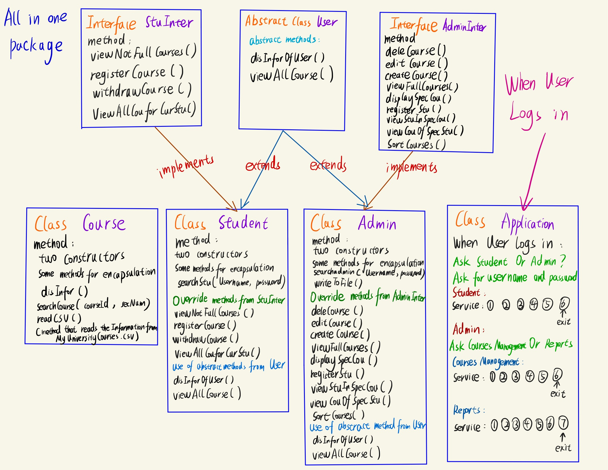

## Introduction:

This is a school project targeted to use OOP to design a University Registration System which needs to satisfy the following requirements.

## The following is my overal design for this project:

##  Requirements:

"Consider the situation where you are hired as a software developer by a new university in your hometown. The university administration wants you to design and implement a Course Registration System (CRS).
As we discussed in class, the very first step of software engineering is Requirements Gathering and Analysis.
After several meetings with your client who represents the school’s administration that deals with student registration, consider the specifications mentioned below that define the requirements you need to implement:"

▪ Req 01: The school shall store the following information about each course:  
Course name, course id, maximum number of students registered in the course, current number of registered students, a list of names of students being registered in the given course, course instructor, course section number, course location.  
▪ See attached MyUniversityCourses.csv file for your university data.  

▪ Req 02: The system shall allow two types of users: Admin and Student

▪ Req 03: The system shall allow the Admin to perform the following tasks: (these are the options that will be in their menu that will be displayed your program when the administrator logs in)
Courses Management
1.Create a new course  
2.Delete a course  
3.Edit a course (this will allow the admin to edit any information on the course except for course ID and name)  
4.Display information for a given course (by course ID)  
5.Register a student (this option will allow the admin to add a student without assigning to a course check Req 11 for student’s information – Hint: You might need to have an ArrayList of Students where you store Student objects)  
6.Exit  

Reports  

1.View all courses (for every course the admin should be able to see the list of course name, course id, number of students registered, and the maximum number of students allowed to be registered)  
2.View all courses that are FULL (reached the maximum number of students)  
3.Write to a file the list of course that are Full  
4.View the names of the students being registered in a specific course  
5.View the list of courses that a given student is being registered on (given a student first name and last name the system shall display all the courses that students is being registered in)  
6. Sort courses based on the current number of student registers   
7. Exit  

▪ Req 04: The system shall allow the student to perform the following tasks:   
Course Management:  
1.View all courses  
2.View all courses that are not FULL  
3.Register on a course (in this case the student must enter the course name, section, and student full name, the name will be added to the appropriate course) Withdrawfromacourse(inthiscasethestudentwillbeaskedtoenterher/hisstudent name and the course, then the name of the student will be taken off from the given course’ list)  
4.Withdraw from a course(in this case the student will be asked to enter her/his student name and the course, then the name of the student will be taken off from the given course’ list)  
5.View all courses that the current student is being registered in  
6.Exit  

During your design meeting with your team you agreed to adopt the following design:

▪ Req 05: Define an Interface for admin class that will have the methods’ signatures that will be used by the Admin

▪ Req 06: Define an Interface for a student class that will have the methods’ signatures that will be used by the student.

▪ Req 07: Both classes Admin and Student inherit from a class named User.
A user should have at least the following class members: username, password, first name, and last name (You will need to decide on the methods a User’s class that could be inherited or overridden by the student and the admin class)

▪ Req 08: At the beginning of launching the program, you will need to read all the courses information from the comma delimited file MyUniversityCourses.csv into an ArrayList of Course Objects. Notice that initially the number of students registered is zero
The student list is null (there are not students registered in the class at the beginning)

▪ Req 09: For simplicity assume that there is one Admin in the program. The username and password for the admin are: Admin and Admin001

▪ Req 10: You do not need to follow this Req.10, you can come up with your own design, that is just as one possibility. At the start of the program, the user is asked to check if they are a student or an admin then if the user is admin, she/he will be asked to enter the username and password. Same applies for student.

▪ Req 11: a student class should have a username, password, first name and last name at least.  
You will need to decide on how to keep track on student’s courses if needed. You might need to decide on how to store a list of students.

▪ Req 12: Serialization  
Serializing an object allows the programmer to convert the state of that object into a byte stream that can
be reverted back into a copy of the object. A Java object is serializable if its class or any of its superclasses implements either the java.io.Serializable interface or its subinterface, java.io.Externalizable. Deserialization is the process of converting the serialized form of an object back into a copy of the object. You will need to use Serialization to store an object permanently (in this assignment’s case it could be used to store the ArrayLists of Student object and the ArrayList of the courses object). Deserialization will be used to read the files where you stored the objects, so you can use them again in your program. When the program exists, you will need to write the latest copy of the ArrayLists or the object you are using into your program into the serialized binary file. The moment you launch your program, you will need to read the files to initiate your objects in your program.

